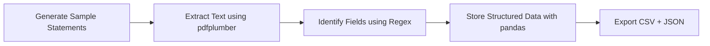

# Sure_fin_assignment

# 🧾 Credit Card Statement Parser


   

---

## 📚 Table of Contents

1. [Project Overview](#project-overview)
2. [Objective](#objective)
3. [Why Google Colab](#why-google-colab)
4. [Tools and Libraries Used](#tools-and-libraries-used)
5. [System Workflow](#system-workflow)
6. [Setup Instructions](#setup-instructions)
7. [Code Structure](#code-structure)
8. [Output Explanation](#output-explanation)
9. [Challenges and Solutions](#challenges-and-solutions)
10. [Future Enhancements](#future-enhancements)
11. [Author](#author)

---

## 🧠 Project Overview

This project automates the extraction of key financial details from **credit card statement PDFs** across multiple banks.
Since each issuer (HDFC, ICICI, SBI, Axis, Kotak) follows a different layout, manual extraction can be tedious and error-prone.

The solution is a **generalized PDF parser** capable of reading, processing, and structuring information using **Python libraries** such as `pdfplumber`, `regex`, and `pandas`.

---

## 🎯 Objective

* Parse real-world PDF statements from **five major credit card issuers**.
* Extract **five key data points** per statement:

  * Cardholder Name
  * Card Last 4 Digits
  * Billing Period
  * Payment Due Date
  * Total Amount Due
* Consolidate extracted information into a single **CSV/JSON file** for analysis.

---

## ☁️ Why Google Colab

Google Colab was chosen as the development environment because it:

* Requires **no local setup** — works directly in the browser.
* Allows quick **package installation** and **OpenJDK setup** for `tabula-py`.
* Provides a **clean, interactive interface** for debugging and showcasing outputs.
* Offers **free cloud compute**, easy file uploads, and instant CSV downloads.
* Enables **public sharing of notebooks** as live, reproducible demos.

*(Alternative: the same code also runs in VS Code with local setup.)*

---

## 🧰 Tools and Libraries Used

| Tool / Library             | Purpose                                  |
| -------------------------- | ---------------------------------------- |
| **Python 3.8+**            | Core programming language                |
| **pdfplumber**             | Extracts text and tables from PDF pages  |
| **tabula-py**              | Parses tabular data from PDFs using Java |
| **reportlab**              | Generates sample credit card statements  |
| **pandas**                 | Data manipulation and CSV export         |
| **regex (re)**             | Pattern matching and text cleaning       |
| **Google Colab / VS Code** | Development environments                 |

---

## 🔁 System Workflow



---

## ⚙️ Setup Instructions

### 🧩 Option 1: Run in Google Colab (Recommended)

1. Open a new Colab notebook → [https://colab.research.google.com](https://colab.research.google.com)
2. Install dependencies:

   ```bash
   !pip install pdfplumber tabula-py pandas reportlab
   !apt-get install -y openjdk-11-jdk-headless
   import os
   os.environ['JAVA_HOME'] = '/usr/lib/jvm/java-11-openjdk-amd64'
   ```
3. Run the PDF generator script to create 5 sample statements.
4. Run the parser script to extract data.
5. Download `credit_card_summary.csv` from the Colab file pane.

---

## 🧱 Structure

```
Credit-Card-Statement-Parser/
│
├── sample_statements/              # Generated test PDFs
│   ├── HDFC_statement.pdf
│   ├── ICICI_statement.pdf
│   ├── SBI_statement.pdf
│   ├── Axis_statement.pdf
│   └── Kotak_statement.pdf
│
├── parser.py                       # Core PDF parsing logic
├── generate_statements.py           # PDF generator (ReportLab)
├── credit_card_summary.csv          # Output data
├── credit_card_summary_full.json    # Detailed structured output
├── README.md                        # Project documentation
└── requirements.txt                 # Library dependencies
```

---

## 📊 Output Explanation

### 🧾 Extracted CSV Output

| bank  | cardholder_name | card_last4 | billing_period           | due_date   | total_amount_due |
| ----- | --------------- | ---------- | ------------------------ | ---------- | ---------------- |
| HDFC  | Riya Sharma     | 1234       | 01/10/2024 to 31/10/2024 | 10/11/2024 | 15400.00         |
| ICICI | Karan Patel     | 5678       | 03/10/2024 to 02/11/2024 | 12/11/2024 | 10200.00         |
| SBI   | Sneha Nair      | 9101       | 10/10/2024 to 09/11/2024 | 18/11/2024 | 8950.00          |
| Axis  | Rohan Deshmukh  | 1122       | 15/09/2024 to 14/10/2024 | 23/10/2024 | 12000.00         |
| Kotak | Ananya Mehta    | 3344       | 05/10/2024 to 04/11/2024 | 13/11/2024 | 9600.00          |

### 📘 JSON Output

* Stores same fields as CSV plus transaction table previews.
* Useful for downstream integrations and API applications.

### 🖥️ Console Logs

```
Parsed: HDFC_statement.pdf ✅
Parsed: ICICI_statement.pdf ✅
Parsed: SBI_statement.pdf ✅
Parsed: Axis_statement.pdf ✅
Parsed: Kotak_statement.pdf ✅
Saved output -> credit_card_summary.csv
```

---

## 🧩 Challenges and Solutions

| Challenge                        | Solution                                                          |
| -------------------------------- | ----------------------------------------------------------------- |
| Different layouts across issuers | Designed flexible regex patterns that match varied label formats. |
| Lack of open datasets            | Used ReportLab to generate realistic synthetic PDFs.              |
| Scanned (image-based) statements | Proposed future integration of OCR (Tesseract).                   |
| Text formatting noise            | Applied string cleaning and space normalization.                  |

---

## 🚀 Future Enhancements

* 🔍 Integrate **OCR (Tesseract)** for scanned PDFs.
* 💡 Develop a **Streamlit dashboard** for user uploads and live extraction.
* 🧾 Extend parsing to **transaction tables** and reward summaries.
* ☁️ Deploy the system as a **REST API** for automation workflows.

---

## 👩‍💻 Author

**Avani Vipat**
📧 *[[avanivipat@gmail.com](mailto:avanivipat@gmail.com)]*
📍 Sardar Patel Institute of Technology, Mumbai
🗓️ November 2025

---

## 🪪 License

This project is open-sourced under the **MIT License** — free to use, modify, and extend for educational or research purposes.
